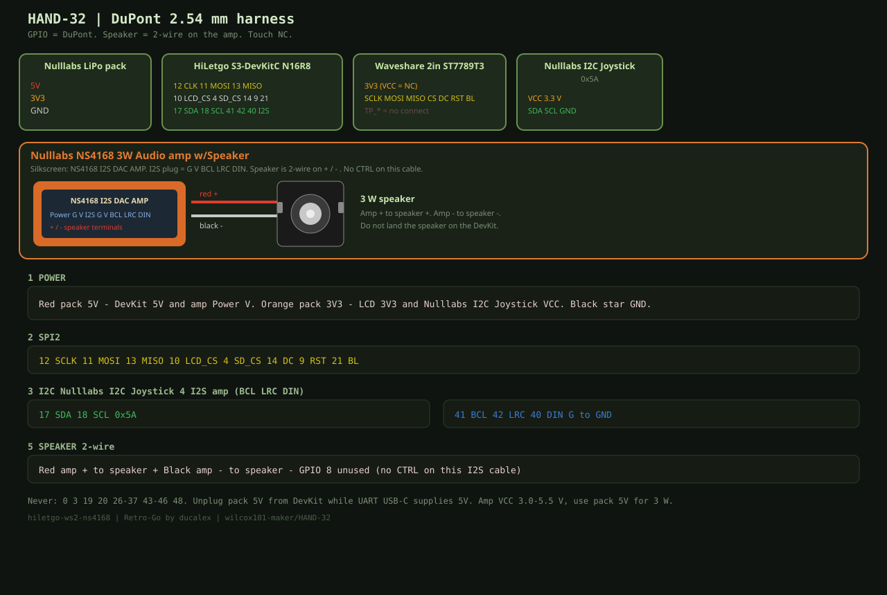

# HAND-32 hardware

Target `hiletgo-ws2-ns4168` for **[Retro-Go](https://github.com/ducalex/retro-go)** by [ducalex](https://github.com/ducalex) (Alex Duchesne) and contributors. Port overlay, not a fork. [CREDITS.md](CREDITS.md).

GPIO nets use **2.54 mm DuPont**. Speaker is a **2-wire** pair on the amp. Touch **NC**.

## Bill of materials

| Qty | Part | Notes |
|---|---|---|
| 1 | HiLetgo ESP32-S3-DevKitC **N16R8** | UART USB-C flash |
| 1 | Waveshare **2 inch** ST7789T3 + TF | Power **3V3**; module **VCC** = NC |
| 1 | **Nulllabs I2C Joystick** `0x5A` | Analog XY, **PB**, **A B C D**. No Start/Select |
| 2 | 6×6 mm tactile (4-pin OK) | **Start** GPIO 5, **Select** GPIO 6, other side GND |
| 1 | **Nulllabs NS4168 3W Audio amp w/Speaker** | I2S G V BCL LRC DIN + 2-wire speaker |
| 1 | Nulllabs LiPo pack | 3.3 V and 5 V |

## Button map

| Control | Retro-Go |
|---|---|
| Joystick XY | D-pad (deadzone 40) |
| A / B | A / B |
| C / D | X / Y |
| PB (stick click) | Menu |
| Tactile GPIO **5** | **Start** (active-low, internal pull-up) |
| Tactile GPIO **6** | **Select** (active-low, internal pull-up) |

## Harness 1 — power

Red pack 5 V → DevKit 5V and amp Power V. Orange pack 3.3 V → LCD **3V3** and joystick VCC. Black star GND. Unplug pack 5 V while UART USB-C supplies 5 V.

## Harness 2 — SPI2

12 SCLK, 11 MOSI, 13 MISO, 10 LCD_CS, 4 SD_CS, 14 DC, 9 RST, 21 BL.

## Harness 3 — Nulllabs I2C Joystick

17 SDA, 18 SCL, 100 kHz, `0x5A`.

## Harness 4 — Nulllabs NS4168 amp I2S

41 **BCL**, 42 **LRC**, 40 **DIN**, G to GND. Power V/G from harness 1. No CTRL on this cable. GPIO 8 unused.

## Harness 5 — speaker

Amp **+** red → speaker +. Amp **−** black → speaker −. Not a GPIO.

## Harness 6 — Start / Select tactiles

| Color | DevKit | Switch |
|---|---|---|
| Grey | **GPIO 5** | Start, one terminal |
| Grey | **GPIO 6** | Select, one terminal |
| Black | **GND** | other terminal of each switch |

No external resistor. Firmware enables internal pull-up; press is **to GND**. Use 6×6 mm or 12×12 mm. Either pair of opposite pins on a 4-pin tactile is the switch.

## Forbidden

Used now: **4, 5, 6, 9, 10, 11, 12, 13, 14, 17, 18, 21, 40, 41, 42**. Leave **8** open.

Never: 0, 3, 19–20, 26–37, 43–46, 48.
