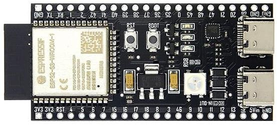
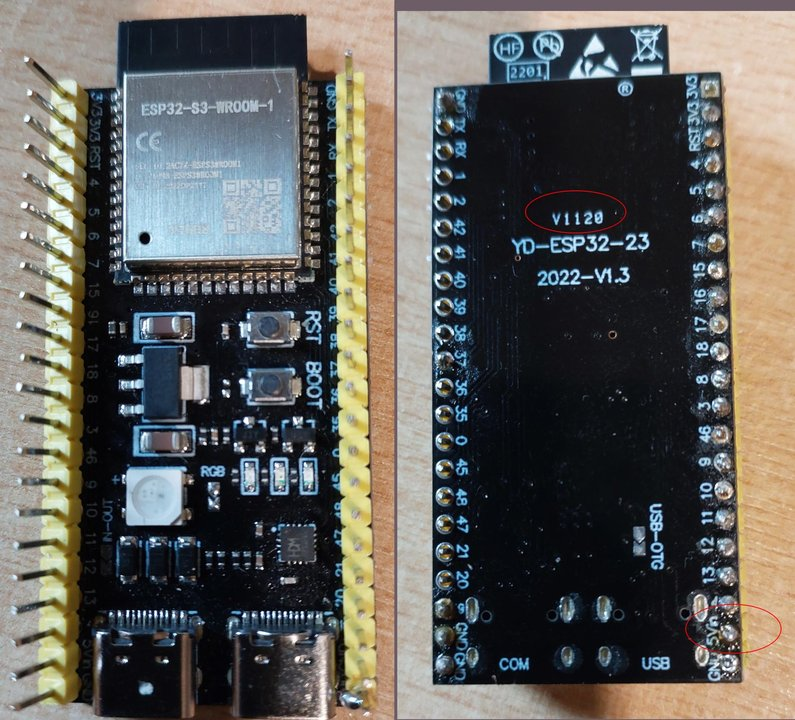
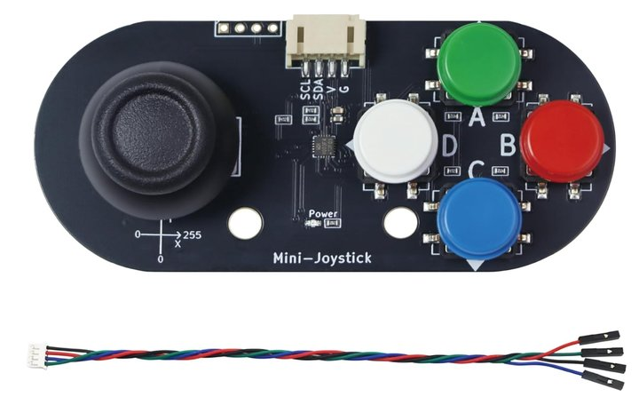
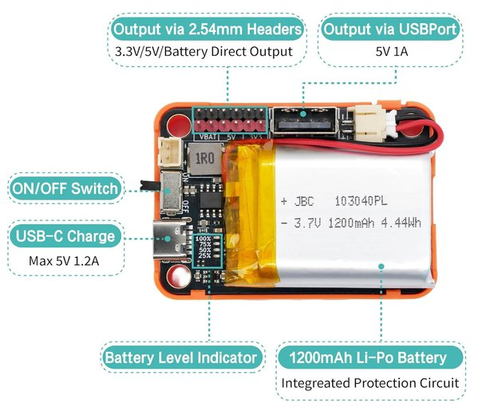
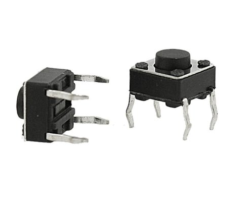
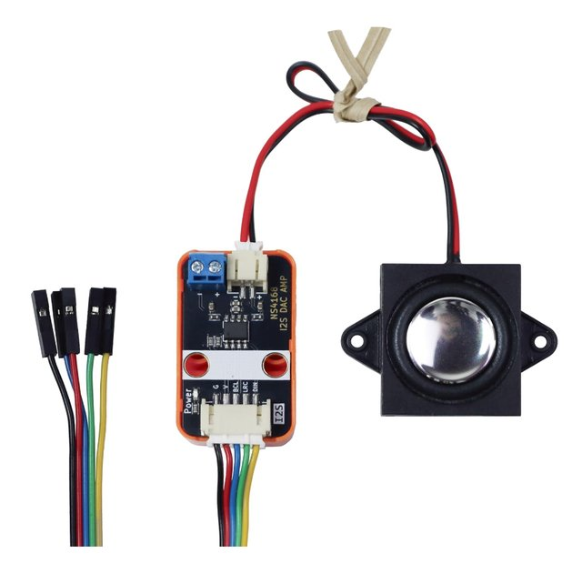

# HAND-32 hardware

Target `hiletgo-ws2-ns4168` for **[Retro-Go](https://github.com/ducalex/retro-go)** by [ducalex](https://github.com/ducalex) and contributors. Port overlay, not a fork. [CREDITS.md](CREDITS.md).

Current firmware is **GPIO tactiles only**. Do not connect the Nulllabs I2C stick — GPIO **17/18** are **X/Y**.

GPIO nets: **2.54 mm DuPont**. Speaker: **2-wire** on the amp. Touch **NC**. LCD **VCC = NC**.

## Photos

MCU is a **YD-ESP32-S3 2022-V1.3** N16R8 (DevKitC-1 clone). Flash on the **UART USB-C** (back silkscreen **USB / COM**), not **USB-OTG**.

Nulllabs I2C Mini-Joystick is **not used** by this firmware (photo kept for the BOM leftover).

**Nulllabs LiPo pack** 1200 mAh. Headers **VBAT / 5V / 3V3**. USB-C charge (max 5 V 1.2 A). USB-A output 5 V 1 A. Use the **5V** and **3V3** headers, not USB-A, for the handheld.

Tactiles: **6×6 mm 4-pin** on a 400-point breadboard. Opposite pins are the switch; adjacent pins on one side are already shorted inside.

**Nulllabs NS4168 3W Audio amp w/Speaker**: I2S **G V BCL LRC DIN**, speaker +/− 2-wire.

## Bill of materials

| Qty | Part | Notes |
|---|---|---|
| 1 | **YD-ESP32-S3** / HiLetgo **N16R8** | Dual USB-C. Flash **UART/COM**, not OTG |
| 1 | Waveshare **2 inch** ST7789T3 + TF | Power **3V3**; module **VCC** = NC |
| 11 | 6×6 mm tactile (4-pin OK) | U/D/L/R A/B/X/Y Start/Select Menu. Other side GND |
| 1 | **Nulllabs NS4168 3W Audio amp w/Speaker** | I2S **G V BCL LRC DIN** + speaker +/− |
| 1 | Nulllabs LiPo pack | Headers **VBAT / 5V / 3V3** |
| 1 | 400-point breadboard | GPIO pad |

## Button map (active-low, internal pull-up → GND)

| GPIO | Retro-Go |
|---|---|
| 1 | Up |
| 2 | Down |
| 7 | Left |
| 8 | Right |
| 15 | A |
| 16 | B |
| 17 | X (C) |
| 18 | Y (D) |
| 5 | Start (also recovery) |
| 6 | Select |
| 39 | Menu |

4-pin 6×6: **opposite corners** only.

## Harness 1 — power

Pack **5V** → DevKit 5V and amp Power V. Pack **3V3** → LCD **3V3** only. Star GND.

LCD **VCC stays NC**. Unplug pack **5V** from the DevKit while UART USB-C supplies 5 V. Do not feed DevKit from pack USB-A and the 5V header at the same time. Play on battery; USB is for flash/serial.

## Harness 2 — SPI2 (LCD + TF)

12 SCLK, 11 MOSI, 13 MISO, 10 LCD_CS, 4 SD_CS, 14 DC, 9 RST, 21 BL.

## Harness 3 — GPIO pad

Each GPIO above to one side of a tactile; other side **GND**. No I2C cable. GPIO 17/18 are X/Y, not SDA/SCL.

## Harness 4 — Nulllabs NS4168 amp I2S

41 **BCL**, 42 **LRC**, 40 **DIN**, G to GND. Power V/G from harness 1. No CTRL pin.

## Harness 5 — speaker

Amp **+** red → speaker +. Amp **−** black → speaker −.

## Forbidden

Used: **1, 2, 4, 5, 6, 7, 8, 9, 10, 11, 12, 13, 14, 15, 16, 17, 18, 21, 39, 40, 41, 42**.

Never: 0, 3, 19–20 (USB), 26–37 (flash/PSRAM), 43–46 (UART0/strap), 47 (octal DQS), 48 (RGB).
