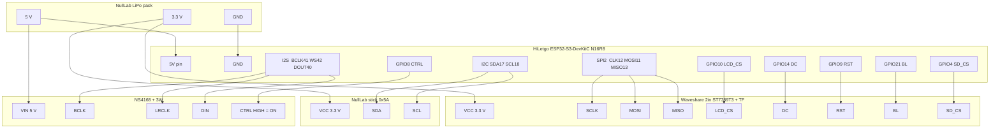

# HAND-32 hardware

Locked pin map for HiLetgo ESP32-S3-DevKitC N16R8 + Waveshare 2" ST7789T3 + NullLab I2C stick + NS4168. Firmware target: `hiletgo-ws2-ns4168` (`config.h`). Touch unused. Battery ADC unused.

## Bill of materials

| Qty | Part | Role |
|---|---|---|
| 1 | HiLetgo ESP32-S3-DevKitC **N16R8** | MCU, 16 MB flash, 8 MB octal PSRAM, 240 MHz |
| 1 | Waveshare **2 inch** LCD, 320×240 **ST7789T3**, TF slot | Panel + ROM storage. Capacitive touch left unconnected |
| 1 | NullLab I2C joystick **0x5A** | Analog XY + face buttons |
| 1 | NullLab NS4168 kit (Class D, I2S) + 3 W speaker | Audio |
| 1 | NullLab LiPo pack, **3.3 V and 5 V** headers | Field power |

## Wiring diagram



ASCII (same netlist):

```
NullLab pack 5V  ----+---- DevKit 5V
                     +---- NS4168 VIN
NullLab pack 3.3V ---+---- Waveshare VCC
                     +---- Stick VCC
NullLab pack GND  -------- DevKit / LCD / stick / amp GND   (common)

DevKit GPIO12  -------- Waveshare SCLK     (LCD + TF clock)
DevKit GPIO11  -------- Waveshare MOSI
DevKit GPIO13  -------- Waveshare MISO     (required for SD)
DevKit GPIO10  -------- Waveshare LCD_CS
DevKit GPIO4   -------- Waveshare SD_CS    (must be a different CS)
DevKit GPIO14  -------- Waveshare DC
DevKit GPIO9   -------- Waveshare RST
DevKit GPIO21  -------- Waveshare BL       (active high)

DevKit GPIO17  -------- Stick SDA          (I2C 0x5A, 100 kHz)
DevKit GPIO18  -------- Stick SCL

DevKit GPIO41  -------- NS4168 BCLK
DevKit GPIO42  -------- NS4168 LRCLK / WS
DevKit GPIO40  -------- NS4168 DIN
DevKit GPIO8   -------- NS4168 CTRL        (drive HIGH = amp ON, right mix)
```

Waveshare **touch** pins: no connect. DevKit **UART USB-C** is the flash/monitor port. Unplug pack 5 V from the DevKit whenever that USB cable is supplying 5 V.

## Pin map

| Function | GPIO | Destination | Notes |
|---|---|---|---|
| SPI CLK | 12 | Waveshare SCLK | Shared LCD + TF |
| SPI MOSI | 11 | MOSI | Shared LCD + TF |
| SPI MISO | 13 | MISO | Required for SD |
| LCD CS | 10 | LCD_CS | SPI2_HOST |
| SD CS | 4 | SD_CS | Distinct chip-select |
| LCD DC | 14 | LCD_DC | |
| LCD RST | 9 | LCD_RST | |
| LCD BL | 21 | LCD_BL | Active high |
| I2C SDA | 17 | Stick SDA | NullLab 0x5A |
| I2C SCL | 18 | Stick SCL | 100 kHz |
| I2S BCLK | 41 | NS4168 BCLK | Do not use 32/33 |
| I2S WS | 42 | NS4168 LRCLK | Philips I2S |
| I2S DOUT | 40 | NS4168 DIN | |
| Amp CTRL | 8 | NS4168 CTRL | HIGH = right + ON |

SPI host: **SPI2**. LCD clock: **40 MHz**. SD: `SDMMC_FREQ_PROBING`. Panel: 320×240, MADCTL `MV | BGR`, inversion `0x21`.

## Do not wire

| GPIO | Why |
|---|---|
| 19, 20 | USB D+/D− |
| 26–32 | Internal flash on WROOM-1 |
| 33, 34 | Not broken out on this DevKit |
| 35, 36, 37 | Octal PSRAM — never touch |
| 0, 3, 45, 46 | Strapping |
| 43, 44 | UART0 console |
| 48 | Onboard RGB LED |

## Power

| Rail | Goes to |
|---|---|
| Pack **5 V** | DevKit `5V` + NS4168 VIN |
| Pack **3.3 V** | LCD VCC + joystick VCC |
| GND | All boards, one star |

NS4168 VIN is **5 V**, not 3.3 V. `RG_BATTERY_DRIVER` is 0 — no cell ADC yet.

## Input / audio protocol

- Stick: I2C read 6 bytes at `0x5A`. XY center 128, deadzone 40 → D-pad. Face bytes → A/B/Start/Select. **Start+Select = Menu**.
- Amp: I2S Philips, mono, CTRL held high.

## Storage

FAT32 microSD in the Waveshare TF slot. Folders: `roms/nes`, `roms/gb`, `roms/gbc`, `roms/sms`.
