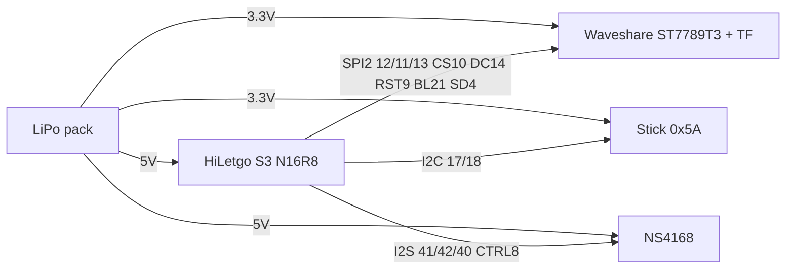

# HAND-32

ESP32-S3 retro handheld overlay for [ducalex/retro-go](https://github.com/ducalex/retro-go).

**Hardware** (pin map, power, wiring): **[HARDWARE.md](HARDWARE.md)**  
**Firmware** (apps, partitions, SD layout): **[FIRMWARE.md](FIRMWARE.md)**

- HiLetgo ESP32-S3-DevKitC **N16R8** (16 MB flash, 8 MB octal PSRAM)
- Waveshare 2" ST7789T3 320×240 (shared SPI TF, no touch)
- NullLab I2C joystick `0x5A`
- NullLab NS4168 I2S Class-D amp + 3W speaker
- NullLab LiPo pack (3.3 V + 5 V headers)

Overlay only. Upstream Retro-Go stays ducalex. **ESP-IDF 5.3.x** (5.3.5 OK). Do not use IDF 6 (`esp_adc_cal` is gone).

## Wiring



| Function | GPIO |
|---|---|
| SPI CLK / MOSI / MISO | 12 / 11 / 13 |
| LCD CS / DC / RST / BL | 10 / 14 / 9 / 21 |
| SD CS | 4 |
| I2C SDA / SCL | 17 / 18 |
| I2S BCLK / WS / DIN | 41 / 42 / 40 |
| NS4168 CTRL | 8 HIGH |

Never: 19–20 USB, 26–37 flash/PSRAM, 0/3/45/46 strap, 48 RGB. Unplug pack 5 V from the DevKit while UART USB-C supplies 5 V.

## Single flash image

One `.img` at `0x0`: launcher + retro-core + Mega Drive + Doom + MSX.

```
git clone --recursive https://github.com/ducalex/retro-go.git
python hiletgo-ws2-ns4168/apply.py retro-go
cd retro-go
```

ESP-IDF **5.3** PowerShell. Apps **before** `--target`:

```
python rg_tool.py build-fw launcher retro-core prboom-go gwenesis fmsx --target hiletgo-ws2-ns4168
python rg_tool.py build-img launcher retro-core prboom-go gwenesis fmsx --target hiletgo-ws2-ns4168
python rg_tool.py install --target hiletgo-ws2-ns4168
```

S3 has no `.fw` packer (`FW_FORMAT = none`). Use `install` (or `esptool write_flash 0x0 *.img`). Do not use `flash` for the first write — that is per-app. UART USB-C; hold BOOT if the port is missing. Always `python rg_tool.py` on Windows.

`apply.py` bumps `PROJECT_APPS` slot sizes so mkfw does not have to grow launcher / prboom-go / fmsx.

## After flash

Cores are **in the firmware**. FAT32 card:

- `roms/nes`, `roms/gb`, `roms/gbc`, `roms/sms`, `roms/gg`, `roms/md`
- Doom IWAD (e.g. `doom.wad`)
- Optional: `retro-go/bios/gb_bios.bin`, `gbc_bios.bin`
- MSX **requires** `retro-go/bios/msx/` BIOS ROMs

## License

Overlay: MIT. Retro-Go cores: upstream licenses. Do not distribute copyrighted ROMs.
